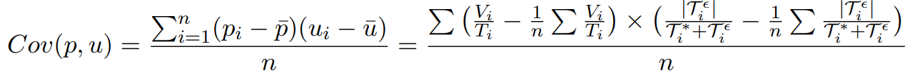

# Statistical Election Fraud Detection 
## :star: Motivation 
This project develops a statistical method to quantify the degree of systematic manipulation that is inherent to fine-graded election results. Read the full paper HERE. `Forensic Data Analytics` `Fraud Detection` 

Often times, countries hold concurrent electoral contests on voting day. When voters arrive at the polling station, they get handed out multiple ballots for different 
races such as 
- presidential election 
- national parliament
- regional parliaments
- referenda

**Now consider this:** While it is perfectly reasonable that across different races, diverging numbers of valid, invalid and spoiled ballots are observed, the *number of ballots received at each polling station necessarily needs to be the same* across all electoral events. Sometimes, this is not the case though. This could be because of administrative errors or human sloppiness. It could also be because people have been selectively adding or removing ballots from the ballot box during voting or counting. Which one is it? `Human Errors` `Ballot box stuffing` `Vote stealing`

## :chart_with_upwards_trend: Visualizing the Issue 
### One polling station
Look at these scanned vote tabulation sheets from the Local Elections 2019 in Ecuador, South America. They come from the same polling station. The left tally depicts the vote tabulation for provincial representatives. The right tally tabulates votes for the city mayor. For provincial representatives (left), 54 ballots have been observed including four blank and two null votes. For the mayorial election, 208 votes have been counted including nineteen blank and fourteen null votes. The magnitude of the inconsistencies is a multiple of the vote distances between the individual candidates.

  
   

### Across the country
The plots below visualize the extent of discrepancies for different years across ~40,000 polling stations in the country. Polling stations are sorted on the x-axis. Whenever the gray lines diverge from the green line, there are discrepancies. 

  
   

## :mortar_board: Formal Treatment
The unsupervised machine learning method that I built separates ballot discrepancies that are due to random errors from systematic discrepancies that are due to fraud. I estimate the share of polling stations where systematic manipulation was executed and discrepancies are non-random. 

$N_i$ is the number of eligible voters across $i=1,...,n$ polling stations. $T_i \in \[0,N_i\]$ denotes the absolute number of turned out voters for a particular electoral race of interest. The share of votes the winning candidate (party) received is denoted by $p_i \in [0,1]$. I show that at each polling station, random errors affect the vote shares of all candidates proportionally to their electoral strength as 

Even if human errors and electoral maladministration are excessive, the extent of discrepancies is unrelated to candidates' vote shares in expectation as 

## 🛠 How I built the method
As a general intuition, the unsupervised model detects systematic manipulation by
- simulating a range of artificial elections which mimic the observed data that are either clean or manipulated to different degrees $S$
- quantifying the average Euclidean distance $M$ between the empirical data and each set of simulated elections
- finding the set of artificial elections that—in expectation—minimizes the distance to the empirical data 

The fraud parameter that was used to construct this set of artificial elections serves as the estimate of fraud

Check out the full paper and analysis HERE. 
