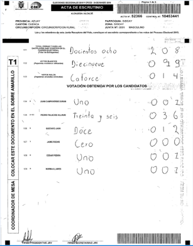

# Statistical Election Fraud Detection: Unsupervised Learning
## :star: Motivation 
This project develops a statistical method to quantify the degree of systematic manipulation that is inherent to fine-graded election results. I focus on one selected pattern: Different numbers of ballots received at the same polling station for concurrent elections that take place simultaneously. Read the full paper [HERE](https://github.com/Lion-Be/undervoting_irregularities/blob/main/Behrens_EPSA2022.pdf). `Forensic Data Analytics` `Fraud Detection` 

Often times, countries hold concurrent electoral contests on voting day. When voters arrive at the polling station, they get handed out multiple ballots for different 
races electing different entities:
- president  
- national parliament
- regional parliaments
- referenda

**Now consider this:** While it is perfectly reasonable that across different races, diverging numbers of valid, invalid and spoiled ballots are observed, the *number of ballots received at each polling station necessarily needs to be the same* across all electoral events. If 152 voters show up at the polling booth, there need to be 152 ballots registered for each electoral race. Sometimes, this is not the case though. This could be because of administrative errors or human sloppiness. It could also be because people have been selectively adding or removing ballots from the ballot box during voting or counting. Which one is it? `Human Errors` `Ballot box stuffing` `Vote stealing`

## :chart_with_upwards_trend: Visualizing the Issue 
### One polling station
Look at these scanned vote tabulation sheets from the Local Elections 2019 in Ecuador, South America. They come from the same polling station. The left tally depicts the vote tabulation for provincial representatives. The right tally tabulates votes for the city mayor. For provincial representatives (left), 54 ballots have been observed including four blank and two null votes. For the mayorial election, 208 votes have been counted including nineteen blank and fourteen null votes. This is a clear inconsistency. The magnitude of the inconsistency is a multiple of the vote distances between the individual candidates.

<p float="left">
  
   
</p>

### Across the country
The plots below visualize the extent of these discrepancies for different years across ~40,000 polling stations in the country. Polling stations are sorted on the x-axis. Whenever the gray lines diverge from the green line (baseline election of members for regional parliaments), there are discrepancies. Conclusion: In the country of Ecuador, there are *many* of these discrepancies. It is an open question whether these are due to human errors or challenges in the administration of elections or due to systematic manipulation. 

<p float="left">
  
   
</p>

## :mortar_board: Formal Treatment
The unsupervised machine learning method that I built takes fine-graded election results at the polling station-level as input, and separates ballot discrepancies that are due to random errors from systematic discrepancies that are due to fraud. I estimate the share of polling stations where systematic manipulation was executed and discrepancies are hence non-random. At first, I derive two properties of election data stemming from multiple concurrent races where ballot discrepancies are generated from a random process without fraud: 

:white_check_mark: **Property 1:** In expectation, observed vote shares for all candidates are equal to their true vote shares even in the presence of excessive errors.

:white_check_mark: **Property 2:** In expectation, there is no statistical association between the extent of undervoting irregularities and the winning candidate’s vote share across polling stations.

$N_i$ is the number of eligible voters across $i=1,...,n$ polling stations. $T_i \in \[0,N_i\]$ denotes the absolute number of turned out voters for a particular electoral race of interest. The share of votes the winning candidate (party) received is denoted by $p_i \in [0,1]$. Across all polling stations, observed turnout levels $T_i$ and winner’s vote shares $p_i$ can be decomposed a


where $T_i^\*$ is the true number of turned out voters, $T_i^\epsilon$ is the absolute number of discrepant votes from the true value either resulting from errors or fraud, $V_i^*$ is the true absolute number of votes cast for the winner and $V_i^\epsilon$ is the number of votes for the winner among all lost or miscounted votes and $V_i$ is the number of votes for the winner that is ultimately observed.

A first scenario is that irregularities exclusively emerge simply because less votes were cast for a particular electoral contest as turned out voters did not receive or hand back all relevant ballots and there is no miscounting of those ballots that have been received. In this case, the error terms $\epsilon_i (i \in \{1,...,n\})$ in (2) simply reduce to zero and observed vote shares are equal to true vote shares as $V^\epsilon_i=0$.

A second scenario is given by ballots not getting accounted for, lost or miscounted although these were cast by turned out voters. Using the loss of votes as a working example, it is intuitive that $\epsilon_i = \frac{V_i^\epsilon}{\mathcal{T}_i^\epsilon}$ consists out of a subset of the true votes, and hence it is straightforward that the erroneous votes themselves can be written as a function of the true votes. Let us imagine that for each individual polling station $i$, there are $j (j \in \{1,...,J\})$ different hypothetical scenarios in which true votes can be lost, and


$\epsilon^j_i$ is denoted as the share of votes for the winner among all lost (or miscounted votes) at a particular polling station, which varies across $J$ hypothetical realizations. In clean elections, not accounted, miscounted or lost votes constitute a truly random sample of the true votes and hence $\mu_i=0$, $E[\xi_i]=0$ and $E[\epsilon_i]=\frac{V_i^*}{T_i^*}$. This means that the expected portion of votes that were cast for the winner among all lost or miscounted votes is equal to the portion of votes cast for the winner among all votes that were originally cast. We can now straightforwardly derive that at each polling station, the miscount or loss of votes---in expectation---affects all candidates proportionally to their electoral strength in clean elections as


Let $u_i$ be the extent of undervoting observed at one particular polling station when comparing the election of interest to a baseline electoral race and let $u_i = \frac{|T_i^\epsilon|}{T_i}$ be the share of votes that are discrepant to a baseline race among the overall number of votes that have been observed in the main race.

We can derive that even if human errors and electoral maladministration are excessive, the extent of discrepancies is unrelated to candidates' vote shares in expectation as 


## 🛠 How to estimate the share of polling stations that is fraudulent
As a general intuition, the unsupervised model detects systematic manipulation by
- simulating a range of artificial elections which mimic the observed data that are either clean or manipulated to different degrees $S$
- quantifying the average Euclidean distance $M$ between the empirical data and each set of simulated elections
- finding the set of artificial elections that—in expectation—minimizes the distance to the empirical data 

The fraud parameter that was used to construct this set of artificial elections serves as the estimate of fraud


The full method is outlined [HERE](https://github.com/Lion-Be/undervoting_irregularities/blob/main/Behrens_EPSA2022.pdf).

## :construction_worker: How to use the method on real data
The user needs to provide a dataset with fine-graded voting results available across individual polling stations and define all respective variables to estimate the share of polling stations at which ballot discrepancies are due to systematic manipulation. 

```r
result <- 
  est_fraud(eligible = data$eligible_voters, 
            turnout_main = data$turnout_raceA,
            turnout_baseline = data$turnout_raceB,
            winner_main = data$winner_A,
            uncertainty = c("fundamental", "estimation"),
            n_iter = 100, 
            n_postdraws = 1000,
            n_burnin = 500,
            seed = 12345
            )
```

